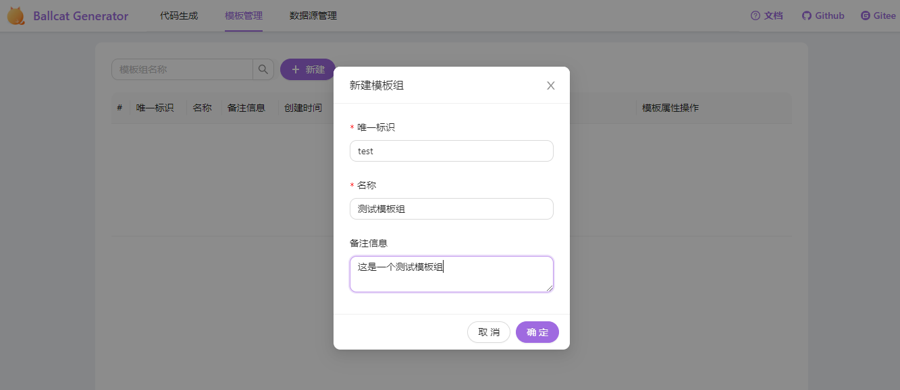
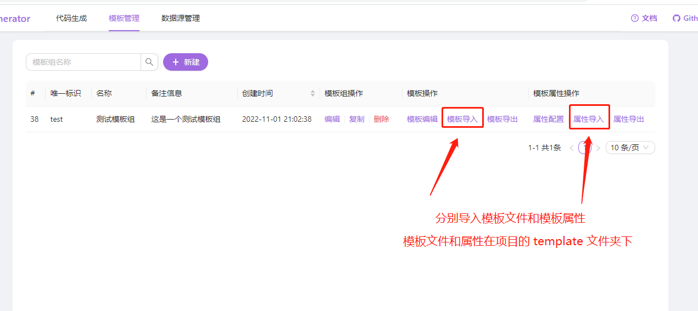

# BallCat-Codegen

执行启动脚本后，运行启动类

```java
com/hccake/ballcat/codegen/GeneratorApplication.java
```

- 启动地址：http://localhost:7777/
- 预览地址：http://codegen.ballcat.cn/
- 文档地址：http://www.ballcat.cn/codegen/

## SQL 脚本的执行

从 v1.1.0 版本开始，sql 表结构以及部分基本数据交由 flyway 管理。

用户只需修改 ballcat-codegen-backend/src/main/resources/application-dev.yml 中的数据源配置，项目启动后即可自动生成数据库和表结构。

> 注意：自动生成数据库依赖 jdbc 的连接参数：createDatabaseIfNotExist=true

## 模板管理

模板组的 sql 不在 flyway 的管理之下，用户自己按需构建模板组。
**欢迎大家 pr 来共享自己创建的模板组**

目前在根目录下的 `template` 文件夹下，提供了 ballcat-admin 的默认模板，用户可按以下步骤进行模板创建：

1. 选择模板管理 -> 新建，创建自己的模板组
  
   模板组唯一标识建议使用纯英文。  


2. 导入模板组文件以及模板组属性
   
    分别导入模板组文件和模板组属性后，即可正常使用


## 如何在不启动前端项目的情况下使用

**必须先在父工程 ballcat-codegen 处执行 `mvn clean package` 打包命令**  

此命令会将前端进行 build，并将打包好的代码 copy 入后端项目的 resource 资源下。

第一次打包时会下载 node 以及前端项目依赖，耗时较久，可以先 cd 进 ballcat-codegen-frontend 前端项目处自行执行 npm install，切换使用淘宝镜像源以加快依赖下载速度。


